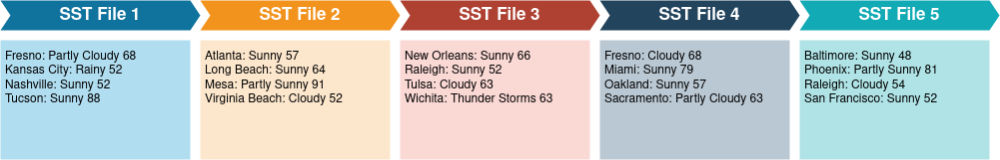
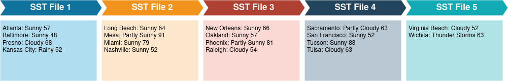
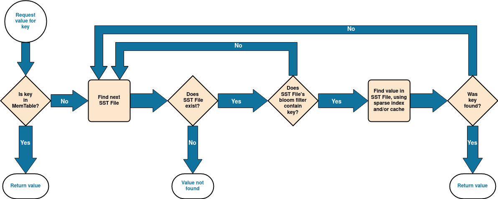

# Introduction

[keyva](https://github.com/justinethier/keyva) is a distributed key-value store using the log-structured merge tree (LSM tree), a popular alternative to B-trees for persistently storing data.  

LSM trees are specifically designed to handle write-heavy workloads. They are used in many popular NoSQL databases including Apache Cassandra, Elasticsearch, Google Bigtable, Apache HBase, and InfluxDB. As well as embedded data stores such as LevelDB and RocksDB.

This document provides implementation details for the LSM tree used by our project. The details are generic and would also apply to other implementations.

# High-Level Design

Data is always added to an LSM tree using sequential writes. That is, data is only written to storage using append operations. This allows fast write operations but does require subsequent compaction to free extra records written when a key is updated or deleted.

The MemTable, a data structure stored entirely in memory, is initially used to store new data. Operations here are very fast but space is limited and the data cannot be retained if the process is restarted. 

In order to recover data across restarts, the same data is also appended to a Write Ahead Log (WAL). The WAL is a simple append-only log that contains a single record for each operation made to the LSM tree.

Eventually the MemTable will become too large to efficiently hold in memory and the data is flushed to a Sorted String Table (SST) file on disk. SST files are indexed and immutable, allowing fast concurrent data access. Eventually when enough SST files are generated a background job will compact them and merge the data into a new "level" of SST files. This gives the tree a chance to remove redudant records and efficiently re-organize data.

SST files can efficiently serve large data sets. (TODO: ref Google Bigtable TB or more of data)

# Data Model

## Key-Value Store

Keyva uses a LSM tree to store data in terms of key/value pairs. Each key is an UTF-8 encoded string and each value is a sequence of bytes.

## Inserts and Updates

As depicted in the overview diagram, data is inserted into the MemTable/WAL and then flows into a series of SST tables. An important consideration is that when data is updated, the original value for the key may still remain in the tree for some time. An update will be added to the MemTable/WAL just like any other insert operation. If they key already resides in the MemTable it will be overwritten with the new value. However, if the old key/value already exists in the table it most likely has already been flushed to an SST and will remain there until the new key/value is merged into that SST level. At this point the old data will finally be discarded and only the latest value will be retained for the key.

## Reads

Continuing on the previous point, when reading data an LSM tree must find the most recent value for a given key. Thus any read operation will start with the MemTable before moving to SST level 0, level 1, etc.

## Deletes

Data cannot be deleted directly from an SST. Instead, the key is flagged as deleted, and the data is deleted later when the SST is compacted. These flagged records are called tombstones.

You can see the `Deleted` flag used in our implementation:

    type SstEntry struct {
    	Key     string
    	Value   []byte
    	Deleted bool
    }

`Value` may be stored as an empty array for a deleted record, so at least we save a bit of space there.

Unfortunately a tombstone cannot be immediately removed when its SST is compacted. The tombstone must reach the highest SST level in the tree before it can be safely removed.

## Write Amplification

The same data may be written to disk multiple times as a key/value is promoted from one level of the SST to another. (An important consideration is to minimize the number of writes)

# Data Structures 

## MemTable

All data added to the LSM tree is initially stored in Memtable, essentially an in-memory cache.

Data in the MemTable needs to be arranged for fast access and ideally for low-cost concurrent read/write operations. A self-balanced tree such as a red-black tree can work well for this purpose. Our implementation uses a [skip list](https://en.wikipedia.org/wiki/Skip_list). 

If a key already exists in the table when a request is recieved the value will be updated directly. This is different than the other data structures employed by the LSM tree, which are immutable.

Deletes must be retained in the table as well. It is important to store a tombstone in case the key still contains data in the SST. The deletion will be resolved later when we compact SST files.

Finally, when the MemTable reaches a certain threshold it must be flushed to disk. A potential optimization here is to allocate a new MemTable and designate the current MemTable as read-only. The old table can then be set off to the side for a background job to write to disk.

## Write Ahead Log

The WAL is a plain-text file containing a dump of all operations on the table. Essentially a transaction log of all operations on the MemTable.

This allows reconstructing the in-memory portion of the tree in the event of service restart for data that has not been flushed to SST yet.

In our implementation a separate WAL file is used for each MemTable. After a MemTable is written to disk its WAL file is purged, as the data is now retained in persistent storage by an SST. This prevents infinite growth of the WAL.  

## Sorted String Table

SST files are the primary data representation for storing an LSM tree on disk. Each one contains a series of key/values sorted by key:

Each file is immutable, making it easier to access data concurrently.

### Sparse Index

notes 
- index does not need to contain all keys since data is sorted
- include every Nth key in the "sparse" index
- bloom filter helps avoid searching a sparse index that does not contain key

### Data Layout

#### Level

SST files are organized into a series of multiple levels starting at level 0. Each level contains more data than the last and the maximum number of levels is configurable.

As shown above files at level 0 may contain overlapping data. For example, observe how the first file contains a key for "Tucson" while the first key in the second file is "Atlanta". 

This ordering is necessary as files are added on-demand as the MemTable reaches capacity. The problem is that in order to find the most recent value for a key in level 0 each SST file must be checked. We need to start from the most recent file and work back to the oldest file.

Higher levels are arranged more efficiently. Consider the same data after being merged to level 1:

As you can see data is guaranteed to be in sorted order across all files in this level. A binary search may be used to find the SST file containing a given key.

(As a result we probably want to minimize the amount of data in level 0, especially for a large dataset)

#### Segment

Data is divided into segments on disk, one per SST file.

Each segment also contains a header (sequence number) and an index.

#### Block 

Data within an SST is divided into blocks. There is one sparse index per block
- binary files
  - optional gzip
  - block (keys within a single sparse index)

this implementation
- size of each segment / index
- caching

# Merge

- compact/merge
  - [k-way merge algorithm](https://en.wikipedia.org/wiki/K-way_merge_algorithm) - link to wiki and code for this
  - when to begin, when to delete files, etc
  - implemented as a streaming algorithm, to allow handling large datasets
  - (keyva - reload levels afterwards, etc)
- background job/thread

## older notes on Compact

* Take files from level `n`
* Compact into new file(s) at level `n + 1`
* Lock the LSM, swap in new files, and delete old files from first step

When to do this? Want a web API function and potentially a background job as well.

See article on this (Link TBD). Can compact at thresholds, time intervals (EG: time series DB), etc. Ultimately would want this to be flexible.

# Bloom Filter

A bloom filter is used to determine if an SST might contain a key before we check the SST. This helps speed up read operations by reducing the amount of disk accesses when reading data:

# Conclusion

And there you have it!

# References

 * Key-value database (Wikipedia)
 * B-tree data structure (Wikipedia)
 * Atomicity (Wikipedia)
 * How I built a key value store in Go ([web])(https://medium.com/@naqvi.jafar91/how-i-built-a-key-value-store-in-go-bd89f68062a8)
 * Badger: Fast key-value DB in Go ([GitHub](https://github.com/dgraph-io/badger))
 * https://github.com/gostor/awesome-go-storage
 * If you want to dive deeper with databases: Database Design for Mere Mortals (Amazon)
 * LSM tree paper - https://www.cs.umb.edu/~poneil/lsmtree.pdf
 * https://www.igvita.com/2012/02/06/sstable-and-log-structured-storage-leveldb/
 * https://medium.com/swlh/log-structured-merge-trees-9c8e2bea89e8

