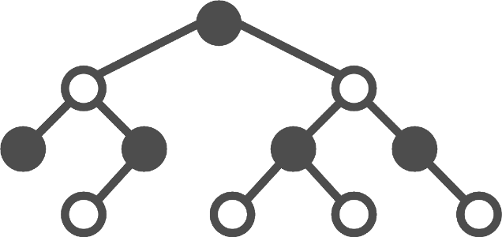

# Introduction

The Log-structured merge tree (LSM tree) is a popular alternative to B-trees for persistently storing data.  LSM tree are specifically designed to handle write-heavy workloads.

Used in many popular NoSQL databases including Apache Cassandra, Elasticsearch, Google Bigtable, Apache HBase, and InfluxDB.

Embedded data stores - (LevelDB and RocksDB)

This document provides an overview of how LSM trees work. Both in the context of this project and in general)

# High-Level Design

Data is always added to an LSM tree using sequential writes. That is, data is only written to disk using append operations. This allows fast write operations but does require subsequent compaction to free extra records written when a key is updated or deleted.

When data is added to the LSM tree it is written to two different places. 

The MemTable, a data structure stored in memory, is initially used to store data. Operations here are very fast but space is limited and the data cannot be retained if the process is restarted. 

In order to recover data across restarts, the same data is also appended to the Write Ahead Log (WAL). The WAL is a simple append-only log that contains a single record for each operation made to the LSM tree. This

Eventually the MemTable will become too large to efficiently hold in memory and the data is flushed to a Sorted String Table (SST) file on disk. 

SST files are indexed and immutable, allowing fast concurrent data access. Eventually when enough SST files are generated a background job will compact them and merge the data into a new "level" of SST files. This gives the

(SST files can efficiently serve large data sets...)

# Data Model

## Key-Value Store

This project uses an LSM tree to store data in terms of key/value pairs. Keys may be any UTF-8 encoded string and each value is a sequence of bytes.

## Insert

## Update

## Delete

Data cannot be deleted directly from an SST. Instead, the key is flagged as deleted, and the data is deleted later when the SST is compacted. These flagged records are called tombstones.

You can see the `Deleted` flag used in our implementation:

    type SstEntry struct {
    	Key     string
    	Value   []byte
    	Deleted bool
    }

`Value` may be stored as an empty array for a deleted record, so at least we save a bit of space there.

Unfortunately a tombstone cannot be immediately removed when its SST is compacted. The tombstone must reach the highest SST level in the tree before it can be safely removed.

## Read

(find most recent value for a key)

## Write Amplification

The same data may be written to disk multiple times as a key/value is promoted from one level of the SST to another. (An important consideration is to minimize the number of writes)

# Data Structures 

## MemTable

All data added to the LSM tree is initially stored in Memtable, essentially an in-memory cache.

Data in the MemTable needs to be arranged for fast access and ideally for low-cost concurrent read/write operations. A self-balanced tree such as a red-black tree can work well for this purpose. Our implementation a [skip list](https://en.wikipedia.org/wiki/Skip_list). 

If a key already exists in the table when a request is recieved, the value will be updated directly. This is different than the other data structures employed by the LSM tree, which are immutable.

Deletes must be retained in the table as well. It is important to store the tombstone in case the key still contains data in the SST. The deletion will be resolved later when we compact SST files.

Finally, when the MemTable reaches a certain threshold it must be flushed to disk. A potential optimization here is to allocate a new MemTable and designate the current MemTable as read-only. The old table can then be set off to the side for a background job to write to disk.

## Write Ahead Log

The WAL is a plain-text file containing a dump of all operations on the table. Essentially a transaction log of all operations on the MemTable.

This allows reconstructing the in-memory portion of the tree in the event of service restart for data that has not been flushed to SST yet.

In our implementation, a separate WAL file is used for each MemTable. After a MemTable is written to disk its WAL file is purged. This prevents infinite growth of the WAL. And the WAL file is not necessary at that point as its data is now retained in persistent storage by the SST. 

## Sorted String Table

SST files are the primary data representation for storing an LSM tree on disk. Each one contains a series of key/values sorted by key:

Each file is immutable, making it easier to access data concurrently.

### Sparse Index

notes 
- index does not need to contain all keys since data is sorted
- include every Nth key in the "sparse" index
- bloom filter helps avoid searching a sparse index that does not contain key

### Data Layout

#### Level

SST files are organized into a series of multiple levels starting at level 0. The maximum number of levels is configurable.

Files at level 0 may contain overlapping data. This is necessary as files are added on-demand as the MemTable reaches capacity:

In order to find the most recent value for a key in level 0 each SST file must be checked, starting from the most recent file and working back to the oldest file.

Higher levels are arranged more efficiently. Data is guaranteed to be in sorted order across all files in the level. So a binary search may be used to find the SST file containing a given key:

#### Segment

Data is divided into segments on disk, one per SST file.

Each segment also contains a header (sequence number) and an index.

#### Block 

Data within an SST is divided into blocks. There is one sparse index per block
- binary files
  - optional gzip
  - block (keys within a single sparse index)

this implementation
- size of each segment / index
- caching

# Merge

- compact/merge
  - [k-way merge algorithm](https://en.wikipedia.org/wiki/K-way_merge_algorithm) - link to wiki and code for this
  - when to begin, when to delete files, etc
  - implemented as a streaming algorithm, to allow handling large datasets
  - (keyva - reload levels afterwards, etc)

# Bloom Filter

A bloom filter is used to determine if an SST might contain a key before we check the SST. This helps speed up read operations by reducing the amount of disk accesses when reading data:

# Conclusion

And there you have it.

(project link)

(what else?)

# References

TBD

# Older notes -

## SST

### Caching
 
 * right now an SST file is cached in memory when read. need a GC job and background thread for this

### Compact

* Take files from level `n`
* Compact into new file(s) at level `n + 1`
* Lock the LSM, swap in new files, and delete old files from first step

When to do this? Want a web API function and potentially a background job as well.

See article on this. Can compact at thresholds, time intervals (EG: time series DB), etc. Ultimately would want this to be flexible.

## Other stuff

* GC cached data
* optional TTL for keys?
