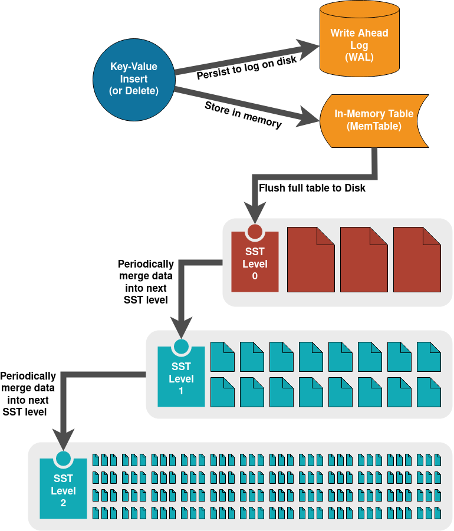

# Overview

The Log-structured merge tree (LSM tree) is a popular alternative to B-trees that databases use for persistently storing data. 

LSM tree are specifically designed to handle write-heavy workloads...

Used in many popular NoSQL databases including Apache Cassandra, Elasticsearch, Google Bigtable, Apache HBase, and InfluxDB.

Embedded data stores - (LevelDB and RocksDB)

This project uses an LSM tree to store data in terms of key/value pairs. Keys may be any UTF-8 encoded string and each value is a sequence of bytes.

This document provides an overview of how LSM trees work (both in the context of this project and in general)

# High-Level Design

At a high level, data is always added to an LSM tree using sequential writes. Data is only written to disk using append operations. This allows fast write operations but does require subsequent compaction to free extra records written when a key is updated or deleted.

When data is added to the LSM tree it is written to two different places. 

The MemTable, a data structure stored in memory, is initially used to store data. Operations here are very fast but space is limited and the data cannot be retained if the process is restarted. 

In order to recover data across restarts, the same data is also appended to the Write Ahead Log (WAL). The WAL is a simple append-only log that contains a single record for each operation made to the LSM tree. This

Eventually the MemTable will become too large to efficiently hold in memory and the data is flushed to a Sorted String Table (SST) file on disk. 

SST files are indexed and immutable, allowing fast concurrent data access. Eventually when enough SST files are generated a background job will compact them and merge the data into a new "level" of SST files. This gives the

(SST files can efficiently serve large data sets...)

# Writing data

inserts
deletes - tombstone

write amplification

# Reading data

TODO: relocate section above data structures??

# Data Structures 

## MemTable

All data added to the LSM tree is initially stored in Memtable, essentially an in-memory cache.

Data in the MemTable needs to be arranged for fast access and ideally for low-cost concurrent read/write operations. A self-balanced tree such as a red-black tree can work well for this purpose. Our implementation a [skip list](https://en.wikipedia.org/wiki/Skip_list). 

If a key already exists in the table when a request is recieved, the value will be updated directly. This is different than the other data structures employed by the LSM tree, which are immutable.

Deletes must be retained in the table as well. It is important to store the tombstone in case the key still contains data in the SST. The deletion will be resolved later when we compact SST files.

Finally, when the MemTable reaches a certain threshold it must be flushed to disk. A potential optimization here is to allocate a new MemTable and designate the current MemTable as read-only. The old table can then be set off to the side for a background job to write to disk.

## Write Ahead Log

The WAL is a plain-text file containing a dump of all operations on the table. Essentially a transaction log of all operations on the MemTable.

This allows reconstructing the in-memory portion of the tree in the event of service restart for data that has not been flushed to SST yet.

In our implementation, a separate WAL file is used for each MemTable. After a MemTable is written to disk its WAL file is purged. This prevents infinite growth of the WAL. And the WAL file is not necessary at that point as its data is now retained in persistent storage by the SST. 

## Sorted String Table

SST files are the primary data representation for storing an LSM tree on disk.

- SST
  - Level - Data divided into multiple levels, starting at 0. Files at level 0 may contain overlapping data. Higher levels contain data in non-overlapping, sorted order across all files.
  - Segment - Data is divided into segments on disk, one per SST file
  - Block - Data within an SST is divided into blocks. There is one sparse index per block

- immutable
- sorted strings (binary search algorithm, link to wiki/code)
- data layout
  - segment (single sst file)
  - block (keys within a single sparse index)
- sparse index
- levels
- bloom filter
- compact/merge
  - k-way merge algorithm (link to wiki/code on this)

this implementation
- size of each segment / index
- caching

# Conclusion

And there you have it.

(project link)

(what else?)

# Older notes -

## Notes

How we ideally want this to work:

## Set

* Add to WAL
* Add to memtable
  (necessary for memtable to have a bloom filter? Or does it have efficient existance checks?)
* Flush to SST
  right now we do this after writing to WAL, so we can empty WAL at the same time. Is that a good idea?

## Get

Basic algorithm to find a value:

TODO: go over this again, revise, then create a diagram (flowchart??)

* check memtable(s)
  - (could be more than one if we support immutable memtables)
* check SST files at level 0
  - At this level we need to check each file, starting from the newest ones first
  - Check bloom filter for each file, only check file if key is in bloom filter
* check SST files at level 1, ...
  - Can be more efficient since keys are sorted across files
  - binary search using sparse index to find appropriate file, then check bloom filter before reading file
  - TODO: implement this in `sst.Find`. TODO: benchmark this vs old algorithm, how much faster is it??

## SST

### Caching
 
 * right now an SST file is cached in memory when read. need a GC job and background thread for this

### Levels

* if we have multiple levels, what happens if a key is in more than one level?
  * check level 0, level 1, etc
* once a level is compacted do we replace SST files with compacted version? (Yes)
  * A very simple algorithm would hold off SST flushes and simply swap out files after compaction. Might be feasible for an MVP
  * how to do this concurrently?
* do we consider generalizing the code to support multiple sst levels, either now or in the future?

### Compact

* Take files from level `n`
* Compact into new file(s) at level `n + 1`
* Lock the LSM, swap in new files, and delete old files from first step

When to do this? Want a web API function and potentially a background job as well.

See article on this. Can compact at thresholds, time intervals (EG: time series DB), etc. Ultimately would want this to be flexible.

### Indexing

* need a way to index into the files
* probably makes more sense with binary files
* sparse index can index into various portions of file (store index in separate file?),
* then sequential search to find entry
* do we even cache file contents at all? maybe if more than N reads in T time

### binary encoding

* would probably be more efficient to write SST files in binary format instead of JSON
* might make it easier to index into a file

## Other stuff

* GC cached data
* optional TTL for keys?
* compact the SST
  when to do this? 
   * background job? 
   * time threshold?
   * have an optional on-demand way to do it
  how do we do this concurrently? How do we know which level of the SST to read data from?
